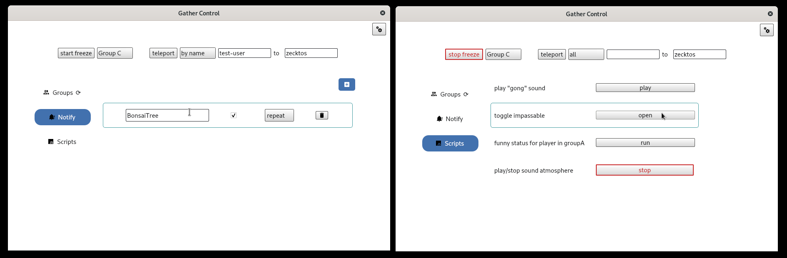

# GatherControl
 **Disclaimer: expect bugs !**  
 **it's only tested in spaces with max 30 people and also Gather Town makes no guarantees about the stability of their API**
___
GatherControl is an gui app to interact with the [Gather Town platform](https://www.gather.town/) and is based on [gather-game-client](https://www.npmjs.com/package/@gathertown/gather-game-client).  You can **teleport** and **freeze** people (and groups), get **desktop notifications** on interaction with objects and trigger your own **custom scripts**.  

## install and setup 
- download a [bundled release](https://github.com/zecktos/gather-control/releases/latest) for linux, windows or macOS 
- on first startup you need to enter your api key & space ID
- to generate your api key create a Gather Town account and go to [https://app.gather.town/apikeys](https://app.gather.town/apikeys)
- as space ID take the part after ``gather.town/app/`` from the url in your browser  

- have fun  
***Note:*** *when you edit the settings (api Key, space ID and script Directory) you need to close and restart the app, after clicking on save, for the changes to take effect*

## build
- install Node.js version 16.x LTS
- clone this repository and run:
```
npm install
npm start
``` 
to package for the operating system you are running, do:
```
npm run-script setup-notifier
npm run-script build
```
you find the app bundle in:
```
./deploy
```